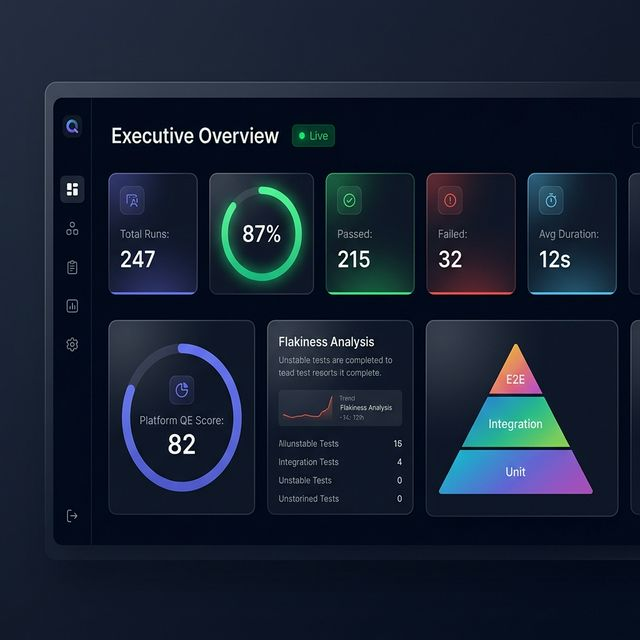
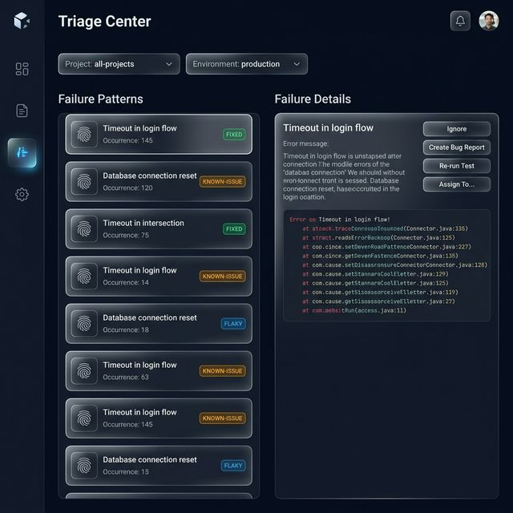
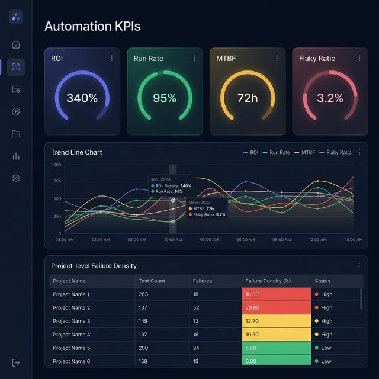

# 🧪 oneQA — Quality Assurance Dashboard

A modern, full-stack test analytics dashboard built with **Next.js 15**, **React 19**, and **Prisma**. oneQA provides deep visibility into test execution data, failure triage, automation KPIs, and project-level quality insights — all wrapped in a premium dark glassmorphism UI.

---

## 📸 Screenshots

### Executive Overview


### Triage Center


### Automation KPIs


---

## ✨ Features

### 📊 Overview Dashboard
- Real-time stats: total runs, pass rate, failures, and average duration
- Interactive trend charts (Recharts) showing test health over time
- Recent test runs feed with environment and project breakdowns

### 🗂️ Project Management
- Multi-project support with per-project KPIs, success rate gauges, and trend analysis
- Project members with role-based access (Owner / Project Lead / Contributor)
- API key management for CI/CD integration

### 🔍 Triage Center
- Failure fingerprinting and pattern matching for efficient root-cause analysis
- Filter by project and environment to focus triage efforts
- Mark patterns as *fixed*, *known-issue*, or *flaky*

### 📈 Automation KPIs
- 12 strategic metrics: ROI, run rate, failure density, MTBF, flaky test ratio, and more
- Orbital gauges, stat cards, and trend charts
- Project-level and environment comparison views

### 🎯 Command Center
- Centralized view of all test runs with filtering and drill-down
- Test suite → test case hierarchy with error details, stack traces, and artifacts

### 🏗️ Additional Modules
- **Success Rates** — Historical success rate tracking per project/environment
- **Performance** — Duration trends and slowest-test analysis
- **Predictive Analytics** — Forecasting based on historical patterns
- **Business Value** — Tie test results to business impact metrics
- **Community Feedback** — Feature request and contact form management

### 🔐 Authentication & Admin
- NextAuth session-based auth with login / registration flow
- Admin approval workflow for new user registrations
- User management panel (add, remove, role assignment)
- Route-level protection via middleware

---

## 🛠️ Tech Stack

| Layer        | Technology                                    |
| ------------ | --------------------------------------------- |
| Framework    | Next.js 15 (App Router, Turbopack)            |
| UI           | React 19, Tailwind CSS, Lucide Icons          |
| Charts       | Recharts 3                                    |
| Auth         | NextAuth.js 4                                 |
| Database     | SQLite (via Prisma ORM)                       |
| Notifications| Sonner (toast notifications)                  |
| Language     | TypeScript 5                                  |

---

## 🚀 Getting Started

### Prerequisites
- **Node.js** ≥ 18
- **npm** ≥ 9

### Installation

```bash
# Clone the repository
git clone https://github.com/shailesh07us-adp/oneQA.git
cd oneQA

# Install dependencies
npm install

# Set up the database
cp .env.example .env        # configure DATABASE_URL and NEXTAUTH_SECRET
npx prisma generate
npx prisma db push

# Seed sample data (optional)
node prisma/seed.js

# Start the dev server
npm run dev
```

The app will be available at **http://localhost:3000**.

### Environment Variables

Create a `.env` file in the project root:

```env
DATABASE_URL="file:./prisma/dev.db"
NEXTAUTH_SECRET="your-secret-key"
NEXTAUTH_URL="http://localhost:3000"
```

---

## 📁 Project Structure

```
dashboard/
├── prisma/
│   ├── schema.prisma        # Data models (User, Project, TestRun, etc.)
│   └── seed.js              # Sample data seeder
├── src/
│   ├── app/
│   │   ├── (dashboard)/     # Authenticated dashboard pages
│   │   │   ├── page.tsx     # Overview dashboard
│   │   │   ├── projects/    # Project management
│   │   │   ├── runs/        # Test run explorer
│   │   │   ├── triage/      # Failure triage center
│   │   │   ├── kpis/        # Automation KPIs
│   │   │   ├── command-center/
│   │   │   ├── success-rates/
│   │   │   ├── performance/
│   │   │   ├── predictive/
│   │   │   ├── business-value/
│   │   │   ├── feedback/
│   │   │   ├── admin/       # User & approval management
│   │   │   ├── settings/
│   │   │   └── users/
│   │   ├── api/             # REST API routes
│   │   ├── login/           # Auth pages
│   │   └── register/
│   ├── components/          # Shared UI components
│   ├── lib/                 # Utilities, Prisma client, helpers
│   └── middleware.ts        # Auth route protection
├── tailwind.config.ts
├── next.config.mjs
└── package.json
```

---

## 📡 API Endpoints

| Method | Route               | Description                          |
| ------ | ------------------- | ------------------------------------ |
| POST   | `/api/ingest`       | Ingest test run data from CI/CD      |
| GET    | `/api/runs`         | List test runs with filters          |
| GET    | `/api/projects`     | List all projects                    |
| GET    | `/api/trends`       | Historical trend data                |
| GET    | `/api/kpis`         | Automation KPI metrics               |
| GET    | `/api/triage`       | Failure patterns for triage          |
| POST   | `/api/auth/[...]`   | NextAuth authentication endpoints    |
| GET    | `/api/users`        | User management (admin)              |
| POST   | `/api/admin/[...]`  | Admin approval workflows             |
| POST   | `/api/feedback`     | Feature requests & contact messages  |
| GET    | `/api/artifacts`    | Test artifacts (screenshots, traces) |

---

## 🧪 CI/CD Integration

Post test results to oneQA using the ingest API:

```bash
curl -X POST http://localhost:3000/api/ingest \
  -H "Content-Type: application/json" \
  -H "x-api-key: oqa_your_api_key" \
  -d @test-results.json
```

---

## 📄 License

This project is proprietary and intended for internal use.
